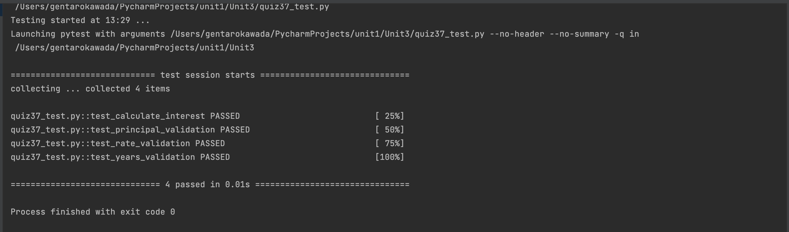

 # Development
## Code
```.py
class CompoundInterest:
    def __init__(self,principal:int, rate:float, year:int):
        self.principal = principal
        self.rate = rate
        self.year = year


class AccountingProgram:
    def __init__(self):
        self.compound = CompoundInterest(0,0,0)
    def set_principal(self,principal):
        if principal <= 0:
            raise ValueError("Principal should be greater than zero")
        self.compound.principal = principal
        return f"Principal set to {self.compound.principal}"

    def set_rate(self,rate):
        if rate <= 0:
            raise ValueError("Interest rate should be greater than zero")
        self.compound.rate = rate
        return f"Rate set to {self.compound.rate}"

    def set_years(self, year):
        if year <= 0:
            raise ValueError("Years should be greater than zero")
        self.compound.year = year
        return f"Year set to {self.compound.year}"

    def calculate_interest(self):
        temp = self.compound.principal*(1+self.compound.rate)**self.compound.year
        format_float = "{:.2f}".format(temp)
        return float(format_float)

```

## test code
```
import pytest
from quiz037 import AccountingProgram

def test_calculate_interest():
    program = AccountingProgram()
    program.set_principal(1000)
    program.set_rate(0.05)
    program.set_years(10)
    interest = program.calculate_interest()
    assert interest == 1628.89

def test_principal_validation():
    program = AccountingProgram()
    with pytest.raises(ValueError) as err:
        program.set_principal(-1000)
    assert "Principal should be greater than zero" in str(err.value)

def test_rate_validation():
    program = AccountingProgram()
    with pytest.raises(ValueError) as err:
        program.set_rate(-0.05)
    assert "Interest rate should be greater than zero" in str(err.value)

def test_years_validation():
    program = AccountingProgram()
    with pytest.raises(ValueError) as err:
        program.set_years(-10)
    assert "Years should be greater than zero" in str(err.value)
```
## Solution overview

