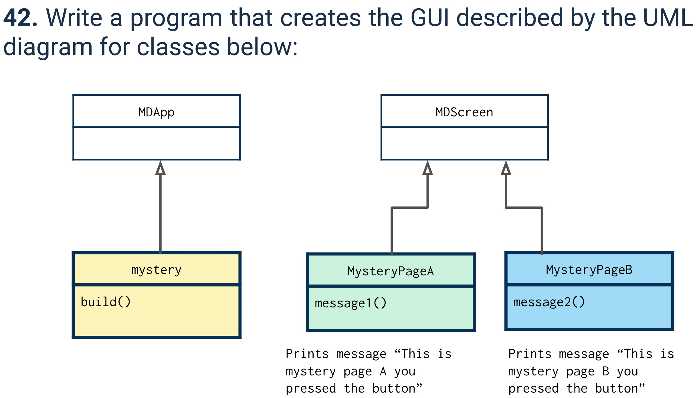
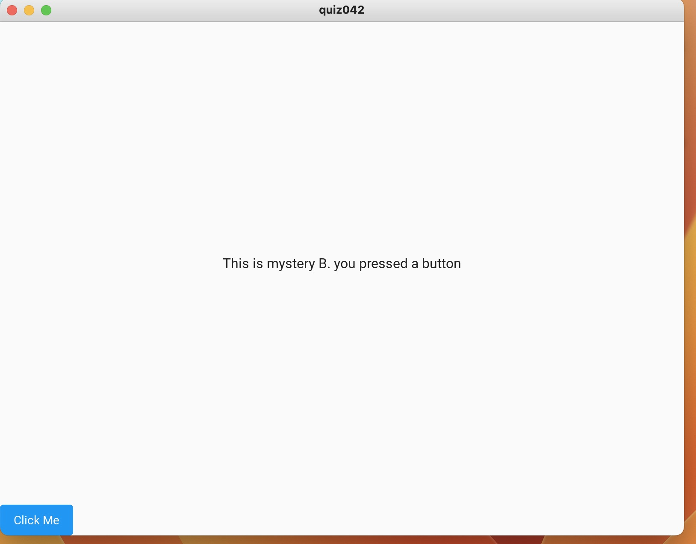

# Quiz 042

## Prompt


## Code Structure

### Python File
```.py
from kivymd.app import MDApp
from kivymd.uix.screen import MDScreen


class MysteryA(MDScreen):
    def messageA(self):
        print("Printing from MysteryA")
        self.ids.label1.text = "This is mystery A. you pressed a button"

class MysteryB(MDScreen):
    def messageB(self):
        print("Printing from MysteryB")

class quiz042(MDApp):
    def build(self):
        return


test = quiz042()
test.run()
```

### KV File
```.kv
ScreenManager:
    id:screenmanager
    MysteryA:
        name: "MysteryA"
    MysteryB:
        name: "MysteryB"

<MysteryA>:
    name: "MysteryA"
    MDBoxLayout:
        orientation: "vertical"
        MDLabel:
            id: label1
            text: "Welcome"
            halign: "center"
        MDRaisedButton:
            text: "Click Me"
            on_press: app.root.current = "MysteryB"
            on_press: root.messageA()

<MysteryB>:
    name: "MysteryB"
    MDBoxLayout:
        orientation: "vertical"
        MDLabel:
            id: label2
            text: "This is mystery B. you pressed a button"
            halign: "center"
        MDRaisedButton:
            text: "Click Me"
            on_press: app.root.current = "MysteryA"

```

## Evidence



*Fig.1* **Image showing GUI of program**
