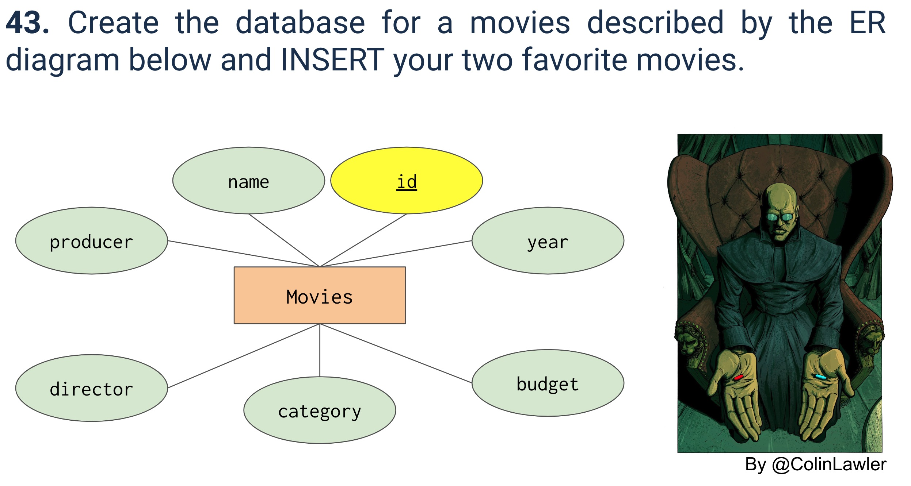
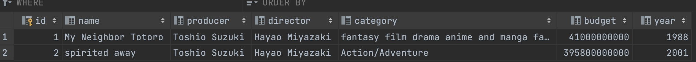

# Quiz 043

## Prompt

## Code Structure

### SQL Script
```.sql
CREATE table if not exists Movies(
    id INTEGER PRIMARY KEY,
    name TEXT,
    producer TEXT,
    director TEXT,
    category TEXT,
    budget INTEGER,
    year INTEGER
)

INSERT INTO Movies (name, producer, director, category, budget, year) VALUES ('My Neighbor Totoro', 'Toshio Suzuki', 'Hayao Miyazaki', 'fantasy film drama anime and manga fantasy anime and manga children''s film supernatural anime', 41000000000, 1988);
INSERT INTO Movies (name, producer, director, category, budget, year) VALUES ('spirited away', 'Toshio Suzuki', 'Hayao Miyazaki', 'Action/Adventure', 395800000000, 2001);
```

## Evidence


*Fig.1* **Image showing GUI of program**
