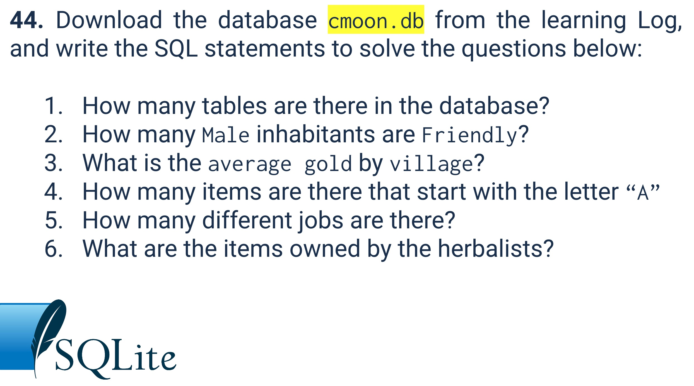

# Quiz 044

## Prompt


## Code Structure

### SQL Script
```.sql
select * from INHABITANT where gender = 'Male';
select * from INHABITANT where gender = 'Male' and state = 'Friendly';
SELECT AVG(gold) from INHABITANT group by villageid;
select * from ITEM where item like 'A%';
select job from INHABITANT group by job;
select item from ITEM where owner is 4 or owner is 18;
```

## Evidence

### https://youtu.be/haKR3VUImX8
