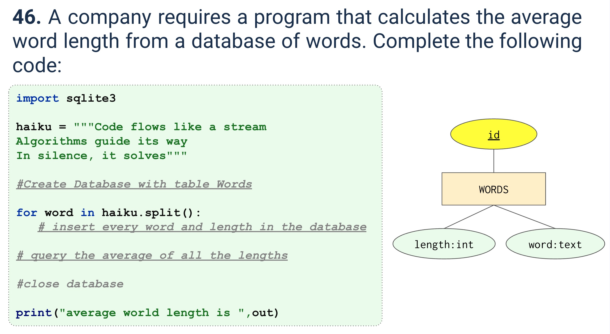
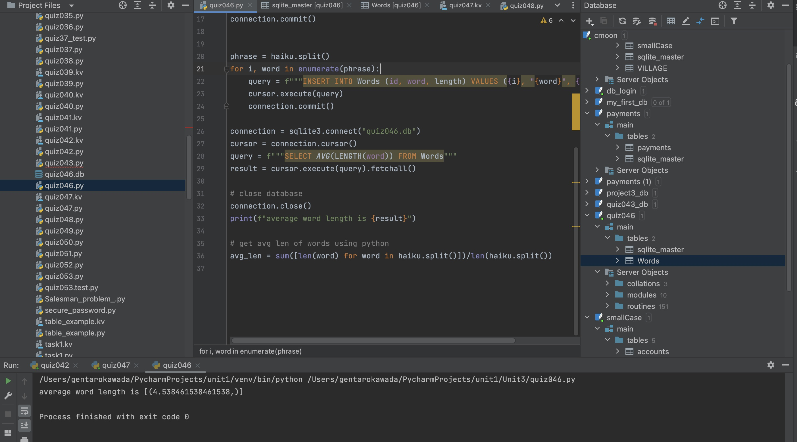

# Quiz 046

## Prompt


## Code Structure

### SQL
```.py
import sqlite3

haiku = """Code flows like a stream
Algorithms guide its way
In silence, it solves"""

connection = sqlite3.connect("quiz046.db")
cursor = connection.cursor()
query = f"""CREATE Table if not exists Words(
       id INTEGER PRIMARY KEY,
       word text NOT NULL unique,
         length INTEGER NOT NULL
   )
   """
cursor.execute(query)
connection.commit()


phrase = haiku.split()
for i, word in enumerate(phrase):
    query = f"""INSERT INTO Words (id, word, length) VALUES ({i}, "{word}", {len(word)})"""
    cursor.execute(query)
    connection.commit()

connection = sqlite3.connect("quiz046.db")
cursor = connection.cursor()
query = f"""SELECT AVG(LENGTH(word)) FROM Words"""
result = cursor.execute(query).fetchall()

# close database
connection.close()
print(f"average word length is {result}")

# get avg len of words using python
avg_len = sum([len(word) for word in haiku.split()])/len(haiku.split())

```


## Evidence


