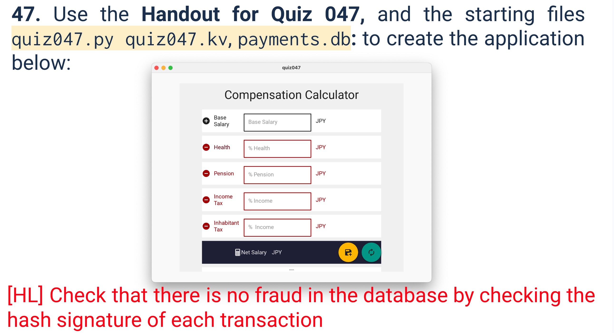

# Quiz 047



## Python
```.py
import sqlite3
from kivymd.app import MDApp
from secure_password import encrypt_password


class database_worker:
    def __init__(self, name):
        self.connection = sqlite3.connect(name)
        self.cursor = self.connection.cursor()

    def search(self, query):
        result = self.cursor.execute(query).fetchall()
        return result

    def run_save(self, query, values):
        self.cursor.execute(query, values)
        self.connection.commit()

    def close(self):
        self.connection.close()


class quiz047(MDApp):
    def __init__(self, **kwargs):
        super().__init__(**kwargs)
        self.hash = ""

    def update(self):
        # This function updates all the labels in the form using the base salary and the percentage
        base = self.root.ids.base.text
        if not base:
            return
        total = int(base)
        hash_str = f"base{total}"
        test_field_ids = ['health', 'pension', 'income_tax', 'inhabitant']
        for i in test_field_ids:
            value = self.root.ids[i].text
            if value:
                new_value = f"{int(value) * int(base) / 100} JPY"
                total -= int(value) * int(base) / 100
                hash_str += f"{i}{value}"
            else:
                new_value = "JPY"
            label_id = f"{i}_label"
            self.root.ids[label_id].text = new_value
        hash_str += f"total{int(total)}"
        self.root.ids.salary_label.text = f"{total} JPY"
        hashed = encrypt_password(hash_str)
        self.hash = hashed
        self.root.ids.hash.text = hashed[-50:]

    def save(self):
        base = self.root.ids.base.text.strip()
        if not base:
            self.root.ids.hash.text = "Base salary is required"
            return
        values = {
            "base": base,
            "inhabitant": self.root.ids.inhabitant_label.text.strip()[:-4],
            "income_tax": self.root.ids.income_tax_label.text.strip()[:-4],
            "pension": self.root.ids.pension_label.text.strip()[:-4],
            "health": self.root.ids.health_label.text.strip()[:-4],
            "total": self.root.ids.salary_label.text.strip()[:-4],
            "hash": self.hash,
        }

        query = "INSERT INTO payments (base, inhabitant, income_tax, pension, health, total, hash) VALUES (?, ?, ?, ?, ?, ?, ?)"
        db = database_worker("payments.db")
        try:
            db.run_save(query, tuple(values.values()))
            self.root.ids.hash.text = "Payment saved"
        except Exception as e:
            print(f"Error saving payment: {e}")
        finally:
            db.close()

    def clear(self):
        for label in ["base", "inhabitant", "income_tax", "pension", "health"]:
            self.root.ids[label].text = ""
            self.root.ids[label + "_label"].text = " JPY"

        self.root.ids["salary_label"].text = " JPY"
        self.root.ids.hash.text = "----"

    def check(self):
        conn = sqlite3.connect('payments.db')
        cursor = conn.cursor()
        cursor.execute("SELECT * FROM payments")
        rows = cursor.fetchall()

        for row in rows:
            get_hashed = encrypt_password(
                f"base{row[1]}inhabitant{row[2]}income_tax{row[3]}pension{row[4]}health{row[5]}total{row[6]}")
            if get_hashed[-50:] == row[7]:
                    print(f"Payment {row[0]} is valid")
            else:
                print(f"Error in id {row[0]}")


test = quiz047()
test.run()

```

## Proof
