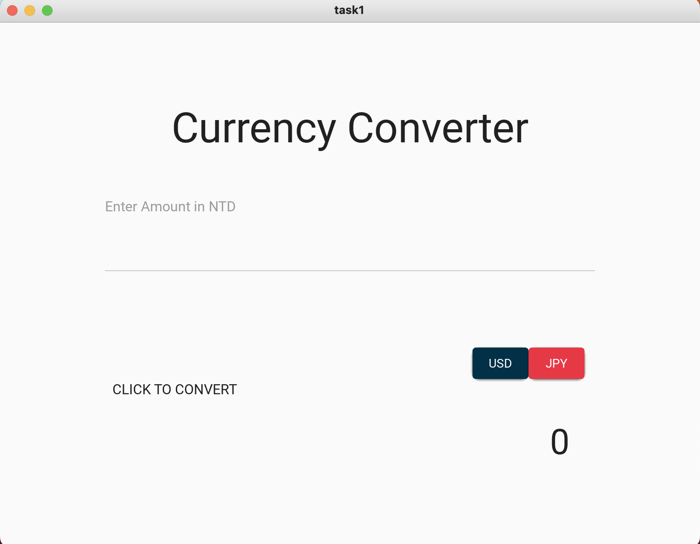
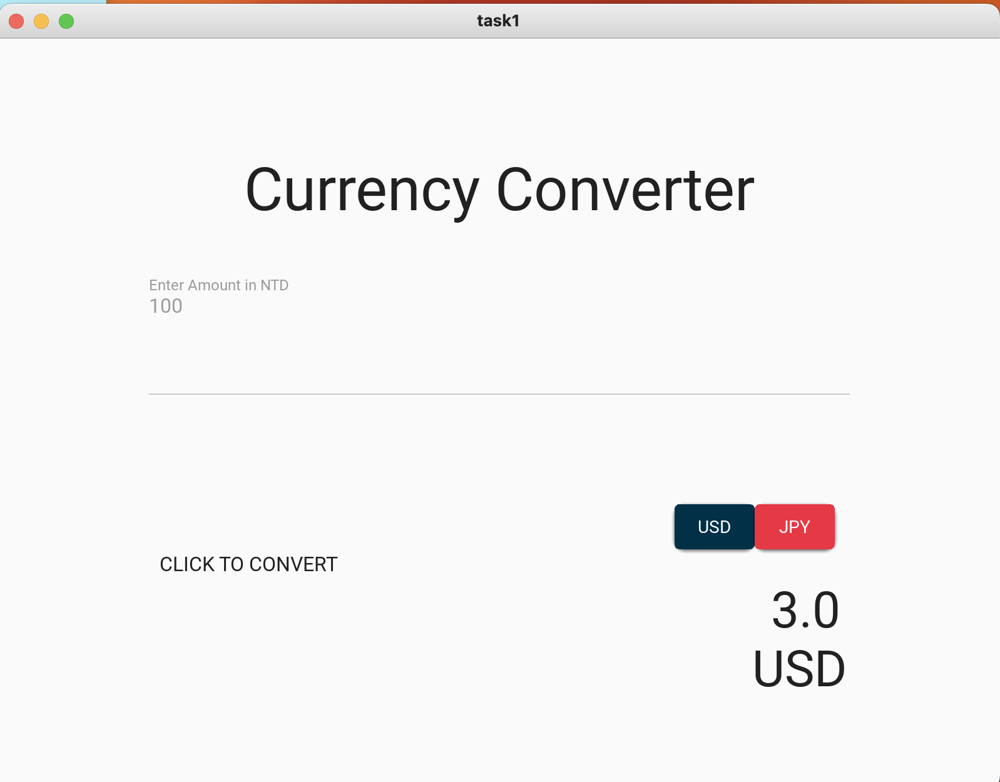
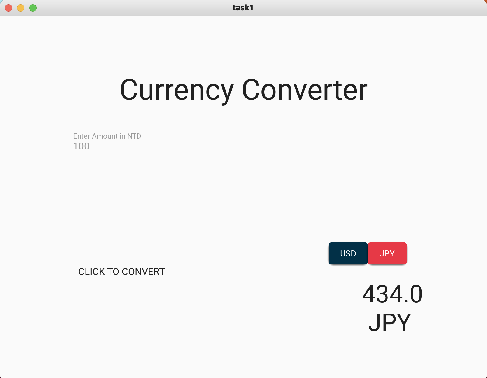

# Task 1: currency converter

## code

### Python
```.py
from kivymd.app import MDApp

class task1(MDApp):
    def __init__(self, **kwargs):
        super().__init__(**kwargs)
        self.ntd=0
        self.exchanged_result=0
    def build(self):
        return
    def set_ntd_amount(self):
        # validation for integer
        if not self.root.ids.input_amount.text.isdigit():
            self.root.ids.show_converted_amount.text = "Please enter a valid number"
        number = int(self.root.ids.input_amount.text)
        self.ntd = number
    def convert_to_usd(self):
        self.exchanged_result = self.ntd*0.03.__round__(2)
        self.root.ids.show_converted_amount.text = f" {self.exchanged_result} USD"
    def convert_to_jpy(self):
        self.exchanged_result = self.ntd*4.34
        self.root.ids.show_converted_amount.text = f" {self.exchanged_result} JPY"


converter=task1()
converter.run()
```

### kv
```.kv
Screen:
    size: 500,500
    MDBoxLayout:
        id: main
        orientation: 'vertical'
        size_hint:1,.8
        pos_hint: {'center_x': .5, 'center_y': .5}

        MDLabel:
            text:"Currency Converter"
            halign: 'center'
            font_style: 'H3'
            size_hint: 1, .2
            pos_hint: {'center_x': .5}

        MDTextField:
            id: input_amount
            hint_text: "Enter Amount in NTD "
            pos_hint: {'center_x':0.5}
            size_hint: .7, .2
            on_text:

                app.set_ntd_amount()

        MDBoxLayout:
            id: exchange_and_results
            orientation: 'horizontal'
            size_hint: 1, .4
            pos_hint: {'center_x':0.5}

            MDLabel:
                id : hint
                text: "CLICK TO CONVERT"
                halign: 'center'
                size_hint: .3, 1
                pos_hint: {'center_x':0.2, 'center_y':0.5}
            MDBoxLayout:
                id: buttons_and_result
                orientation:"vertical"
                size_hint: .3, 1
                MDBoxLayout:
                    id: buttons_box
                    orientation: "horizontal"
                    size_hint: .7, 1
                    pos_hint: {'center_x':0.7, 'center_y':0.9}
                    MDRaisedButton:
                        id: usd
                        text: "USD"
                        pos_hint: {"center_x": 0.25, "center_y": .25}
                        on_release: app.convert_to_usd()
                        md_bg_color:"#023047"
                    MDRaisedButton:
                        id: jpn
                        text: "JPY"
                        pos_hint: {"center_x": 0.75, "center_y": .25}
                        on_release: app.convert_to_jpy()
                        md_bg_color:"#e63946"
                MDLabel:
                    id: show_converted_amount
                    text: "0"
                    halign: 'center'
                    font_style: 'H5'
                    text_color: "#000000"
                    size_hint: .3, 1
                    pos_hint: {'center_x':0.6}
                    font_size:80
```

## Showcase



