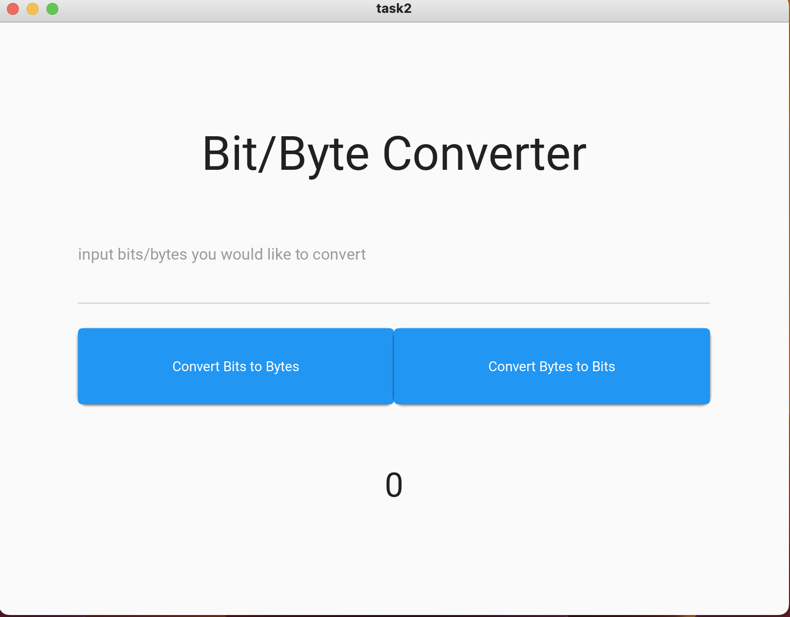
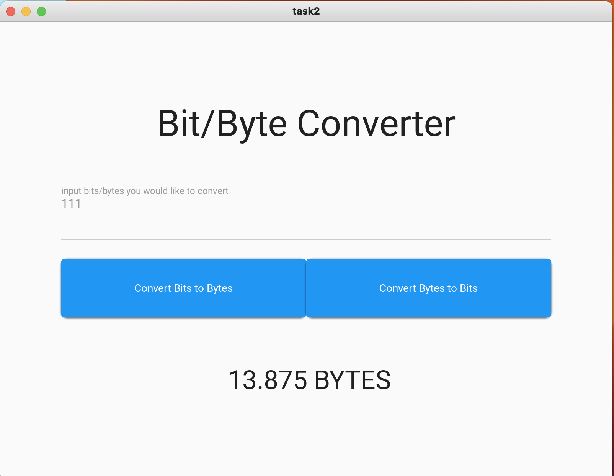
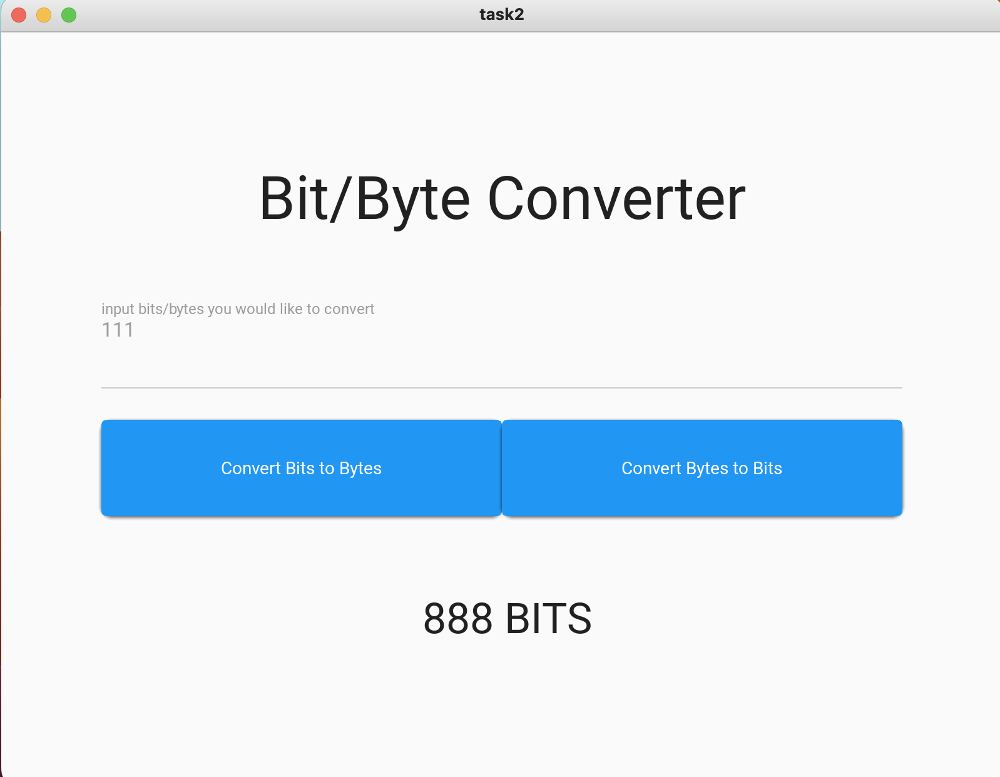

# Task 2: bit-byte converter

## code

### Python
```.py
from kivymd.app import MDApp

class task2(MDApp):
    def __init__(self, **kwargs):
        super().__init__(**kwargs)
        self.input=0
        self.exchanged_result=0
    def build(self):
        return
    def set_input(self):
        # validation for integer
        if not self.root.ids.output.text.isdigit():
            self.root.ids.show_converted_amount.text = "Please enter a valid number"
        number= int(self.root.ids.input.text)
        self.input = number
    def byte_to_bit(self):
        self.exchanged_result = self.input*8
        self.root.ids.output.text = f" {self.exchanged_result} BITS"
    def bit_to_byte(self):
        self.exchanged_result = self.input/8
        self.root.ids.output.text = f" {self.exchanged_result} BYTES"


converter=task2()
converter.run()
```

### kv
```.kv
Screen:
    size: 500,500
    MDBoxLayout:
        id: main
        orientation: 'vertical'
        size_hint:.8,.8
        pos_hint: {'center_x': .5, 'center_y': .5}

        MDLabel:
            text: 'Bit/Byte Converter'
            halign: 'center'
            font_style: 'H3'
            size_hint: 1, .3
            pos_hint: {'center_x': .5, 'center_y': .5}

        MDTextField:
            id: input
            hint_text: 'input bits/bytes you would like to convert'
            size_hint: 1, .2
            pos_hint: {'center_x': .5, 'center_y': .5}
            on_text: app.set_input()

        MDBoxLayout:
            id: buttons
            orientation: "horizontal"
            size_hint: 1, .2
            pos_hint: {'center_x': .5, 'center_y': .5}

            MDRaisedButton:
                id: bit_to_byte
                text: 'Convert Bits to Bytes'
                size_hint: .5, .8
                pos_hint: {'center_x': .5, 'center_y': .5}
                on_release: app.bit_to_byte()
            MDRaisedButton:
                id: byte_to_bit
                text: 'Convert Bytes to Bits'
                size_hint: .5, .8
                pos_hint: {'center_x': .5, 'center_y': .5}
                on_release: app.byte_to_bit()
        MDLabel:
            id: output
            text: '0'
            font_style: 'H4'
            halign: 'center'
            size_hint: 1, .3
            pos_hint: {'center_x': .5, 'center_y': .5}
```

## Showcase



